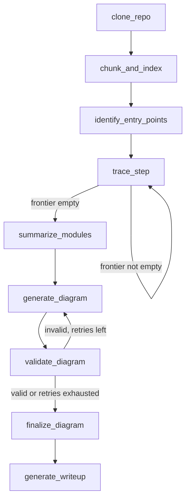

# Codebase Cartographer

Point it at any public GitHub repo. It clones it, indexes it with RAG, traces
the real import graph, and produces an architecture diagram + written
overview — with a self-correction loop so a broken diagram gets fixed
automatically instead of shipping invalid syntax.

It draws a map of a codebase you've never seen before.

```
python main.py https://github.com/psf/requests
```

## Why this exists

Dropping into an unfamiliar codebase is a problem every engineer has felt.
This automates the first 30 minutes of that: "where does execution start,
what depends on what, and what does each piece actually do."

## Architecture



Two loops, both implemented as real LangGraph self-edges (a node routing
back to itself via a conditional edge), not hidden Python `while` loops:

1. **`trace_step`** — pops one file off a frontier queue, extracts its
   imports, resolves them to real files in the repo, and enqueues any new
   ones. Repeats until the frontier is empty — i.e. until every reachable
   file has been visited.
2. **`generate_diagram` → `validate_diagram`** — the LLM writes Mermaid
   syntax, a deterministic validator checks it's actually well-formed, and
   invalid output routes back to `generate_diagram` with the specific error
   message included in the next prompt. Capped at `max_diagram_retries`; if
   every attempt still fails, `finalize_diagram` swaps in a diagram built
   deterministically from the same edge data, so the pipeline always
   finishes with something valid instead of erroring out.

## Where RAG is actually used (and where it deliberately isn't)

- **`chunk_and_index`** is genuine RAG: every source file is split with a
  language-aware chunker, embedded **locally** (HuggingFace/sentence-transformers
  — see `src/llm.py`), and persisted to a local Chroma vector store. No API
  call happens during indexing.
- **Entry-point detection and import tracing are NOT RAG** — they're
  regex/structural checks (`src/parsing.py`). This is a deliberate choice:
  "which file does `main.py` import" is a deterministic question with one
  right answer, and a static check is faster, free, and more reliable than
  asking an LLM to guess it from a retrieved chunk.
- **RAG earns its keep for the genuinely open-ended question**: after
  indexing, `src/qa.py` lets you ask free-form questions like *"what
  handles authentication?"* — a question where you don't know which file
  holds the answer in advance, which is exactly the problem RAG solves.

```
python -m src.qa <vectorstore_dir> "What handles authentication?"
```

(the `vectorstore_dir` is printed at the end of a `main.py` run)

## Setup

Runs **fully locally** — no API key, no `.env` file, no cloud dependency at all.

```
# 1. install Ollama and pull the chat model (one-time, needs internet)
#    https://ollama.com/download
ollama pull qwen2.5-coder:3b

# 2. install Python dependencies
pip install -r requirements.txt

# 3. run it — embeddings download automatically on first use (~130MB, one-time)
python main.py examples/tiny_repo               # try this FIRST
python main.py https://github.com/<user>/<repo>  # once that works, point it at a real repo
```

Passing a local folder instead of a URL skips `git clone` entirely —
`clone_repo_node` detects it with a plain `os.path.isdir` check, so this
also works for analyzing your own uncommitted local projects.

Both halves of the pipeline are local now:
- **Embeddings** (`chunk_and_index`) — HuggingFace/sentence-transformers,
  downloaded once (~130MB) and cached; every run after that is offline.
- **Chat/generation** (`summarize_modules`, `generate_diagram`, `generate_writeup`)
  — served by Ollama running on your machine (default `localhost:11434`).
  Ollama needs to be running, and the model needs to be pulled once with
  `ollama pull qwen2.5-coder:3b` — after that, no network call happens at all.

`max_summarize` in `main.py` still caps how many files get an LLM-written
summary (default 15) — no longer a cost concern, but it keeps a run on a
large repo from taking forever on typical laptop hardware.

**A note on this project's own history**: this started on Gemini for both
embeddings and chat, hit Gemini's free-tier rate limit (100 `embed_content`
requests/minute) during testing, then moved to local models one piece at a
time — embeddings first (removing the rate-limit problem at the source),
then chat (removing the API dependency entirely). Each step's now-unused
code was deleted rather than left around: the retry-with-backoff logic that
handled Gemini's 429s, then the `GOOGLE_API_KEY`/`.env` requirement itself.

### Optional: rendering an actual PNG

`architecture.mmd` is Mermaid TEXT, not a picture — it needs a renderer to
become an image. `main.py` will do this automatically at the end of a run
if [mermaid-cli](https://github.com/mermaid-js/mermaid-cli) is installed:

```
npm install -g @mermaid-js/mermaid-cli
```

If it's not installed, the run still completes normally — you just won't
get `architecture.png`, and a message tells you to either install it or
paste `architecture.mmd` into https://mermaid.live instead. `mmdc` itself
depends on a headless Chrome/Chromium under the hood (via Puppeteer); if
that's missing on your machine, `render_mermaid_to_png()` fails gracefully
and returns `False` rather than crashing the pipeline — the `.mmd` and
`.md` outputs are unaffected either way.

## Testing without Ollama running

`test_pipeline.py` runs the real graph — real chunking config, real regex
import tracing, real LangGraph loop wiring — against a small synthetic repo,
with only the chat-completion calls mocked out (embeddings are already
local and need no mocking). It specifically proves the retry loop fires on
an invalid diagram and succeeds on the next attempt, and that the
deterministic fallback kicks in if every retry fails.

```
python test_pipeline.py
```

## Project layout

```
main.py              CLI entry point
src/state.py          the shared state schema every node reads/writes
src/parsing.py         regex-based import extraction + entry-point detection (no LLM)
src/indexing.py         clone + chunk + embed locally + persist to Chroma (the RAG indexing step)
src/llm.py               model wrappers: local embeddings + local Ollama chat, isolated so tests can mock them
src/render.py              optional Mermaid .mmd -> .png rendering via mermaid-cli
src/nodes.py                every LangGraph node function
src/graph.py                 wires nodes.py into the actual StateGraph
src/qa.py                     free-form RAG Q&A over the persisted vector store
test_pipeline.py                integration test, no Ollama/network required
```

